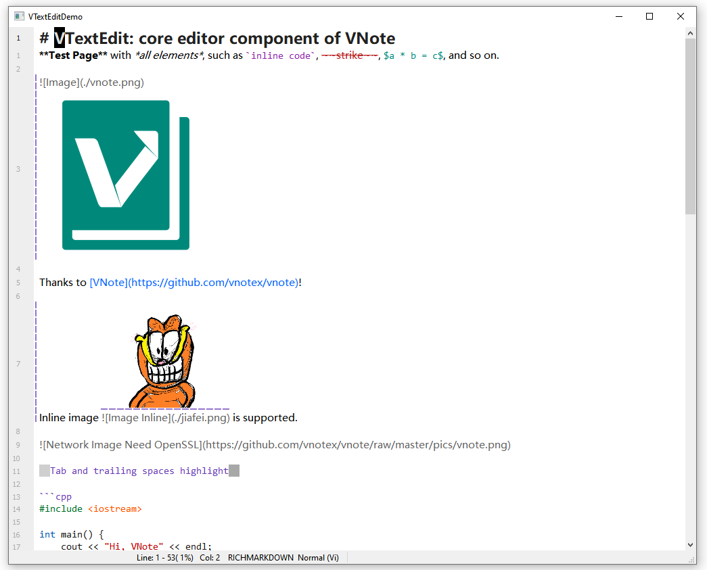

# vtextedit
This project contains the key editor components for [VNote](https://github.com/vnotex/vnote), including:

* `VTextEdit`: the basic edit widget derived from `QTextEdit`.
* `VTextEditor`: a fully-functional editor for plain text, with Vi and syntax highlight supports.
* `VMarkdownEditor`: a fully-functional editor for Markdown derived from `VTextEditor`, with in-place preview support.

Check the `demo` project and VNote for details.

## Font colors in Markdown

The source editor colors the contents of matched `text` tags.
`color` accepts named colors and hex values such as `#008000` or `#0f0`, with or without
quotes. Nested colors restore the enclosing color when closed; contents can span lines,
but each tag must fit on one line. Bold, italic, and other Markdown formatting is retained.
The tags remain visible, and the source is not rewritten.

Invalid or missing colors inherit a matched enclosing font's color. Unclosed tags do not
color the rest of the document. Tags inside Markdown code, comments, or HTML raw-text
elements are not interpreted. This is `color`-attribute support, not general CSS styling.

## License
This project is licensed under [GNU LGPLv3](https://opensource.org/licenses/LGPL-3.0).
